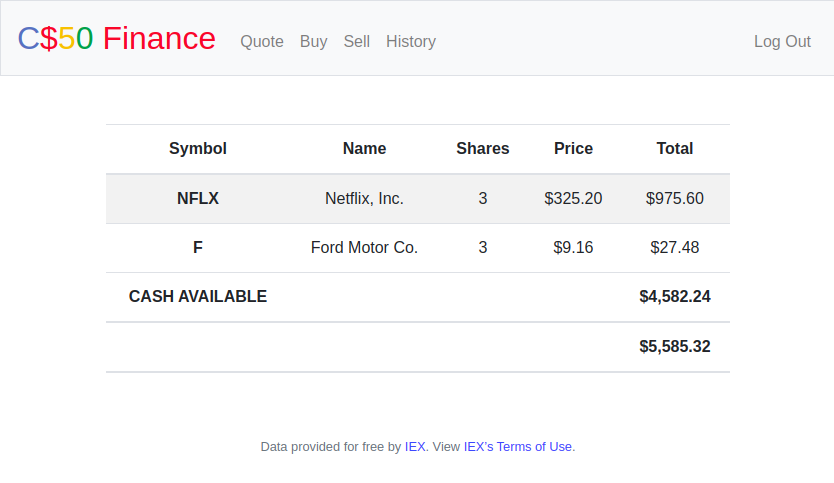

# CS50-Finance
Problem Set 8 from CS50 Course (Week 8).

## Overview
A virtual exchange web application that allows you to buy/sell shares at current prices.

## Features
<ul>
    <li>Registration & Login</li>
    <li>Query Stock Prices</li>
    <li>Buy & Sell Stocks</li>
    <li>Transaction History</li>
</ul>

## Screenshots

#### Login

#### Register

#### History

## Getting Started
<ol>
    <li>Install all dependencies using the command: <code>pip install -r requirements.txt</code></li>
    <li><a href="iexcloud.io/cloud-login#/register/">Register for IEX API key</a></li>
    <li><code>export FLASK_APP=application.py</code></li>
    <li>Export your key as an environment variable: <code>export API_KEY=[YOUR_API_KEY]</code></li>
    <li>Run the development web server using the command: <code>flask run</code></li>
</ol>
